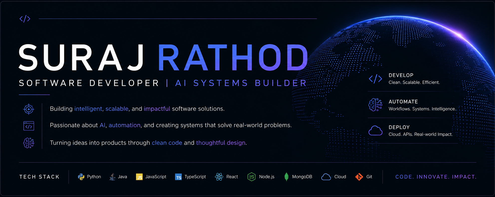

  

# Suraj Rathod

### Software Developer | Computer Engineering Student

I build software applications, intelligent systems, and automation-driven solutions that solve real-world problems.

Currently focused on:

* Software Engineering
* Artificial Intelligence
* Full-Stack Development
* System Design
* Cloud Technologies
* Workflow Architecture

---

## Featured Projects

### AutoViral Engine

AI-powered social media video production system that transforms a single idea into a fully rendered video through autonomous workflow orchestration.

### AI-Powered First Aid Health Assistant

Intelligent health assistance platform designed to provide instant guidance during emergency situations.

### Sentinel Vision

Computer vision system focused on intelligent detection and analysis.

### Mosquito Tracking AI

AI-driven monitoring and tracking solution for mosquito movement analysis.

### Weather Monitoring System

Real-time weather monitoring and reporting platform.

---

## Tech Stack

### Languages

* Python
* Java
* JavaScript
* TypeScript
* SQL

### Development

* React
* Node.js
* Express.js
* Git
* GitHub

### AI & Data

* OpenAI
* Machine Learning
* Computer Vision
* Prompt Engineering

### Cloud & Automation

* Google Cloud
* n8n
* REST APIs
* Workflow Design

---

## Current Focus

Building production-ready software systems that combine modern software engineering practices with artificial intelligence and automation technologies.

---

## Connect

* LinkedIn: [www.linkedin.com/in/suraj-rathod-dev](http://www.linkedin.com/in/suraj-rathod-dev)
* GitHub: github.com/Surajrathod07
